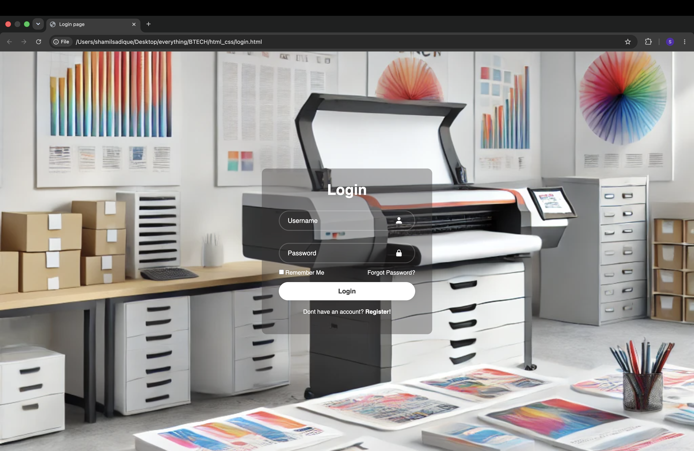
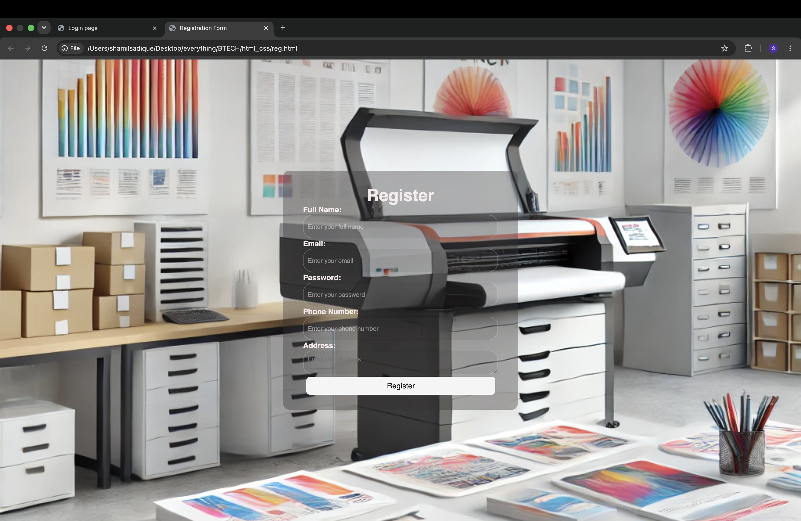
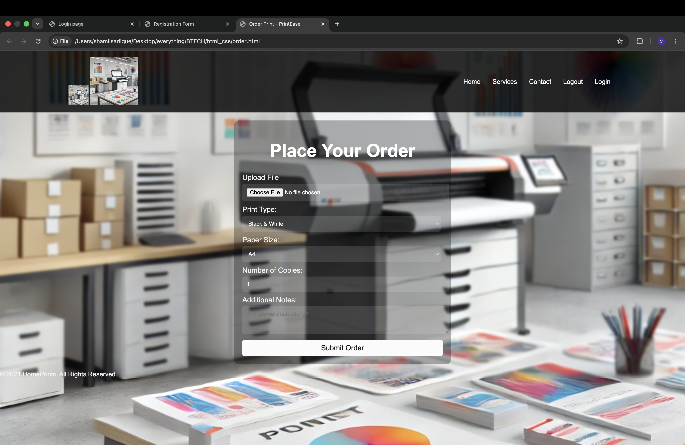

# Remote Printing System

## Overview

Remote Printing System is a web-based application developed using Django that enables users to submit print requests online and manage their printing tasks remotely. The system provides user authentication, order submission, order tracking, and profile management features.

## Features

- User Registration and Login
- Secure Authentication System
- Email Verification Support
- Print Order Submission
- Order Status Tracking
- User Profile Management
- Order History Viewing
- Responsive Web Interface

## Technologies Used

### Backend
- Python
- Django

### Frontend
- HTML5
- CSS3
- JavaScript

### Database
- SQLite

## Project Structure

text remote printing system/ ├── authentication/ ├── printing_service/ ├── user/ ├── static/ ├── templates/ ├── manage.py ├── Pipfile ├── Pipfile.lock └── README.md 

## Installation

### Clone the Repository

bash git clone https://github.com/shamilsadique/remote-printing-system.git 

### Navigate to the Project Directory

bash cd remote-printing-system 

### Install Dependencies

bash pip install pipenv pipenv install 

### Run Database Migrations

bash python manage.py migrate 

### Start the Development Server

bash python manage.py runserver 

### Access the Application

Open your browser and visit:

text http://127.0.0.1:8000/ 

## Future Enhancements

- Online Payment Integration
- Real-time Print Status Updates
- Admin Analytics Dashboard
- PDF Preview Before Printing
- Mobile Application Support

## Screenshots

### Login Page

### Registration Page

### Order Submission Page

## Author

Shamil Sadique

GitHub: https://github.com/shamilsadique

## License

This project was developed for educational and academic purposes.